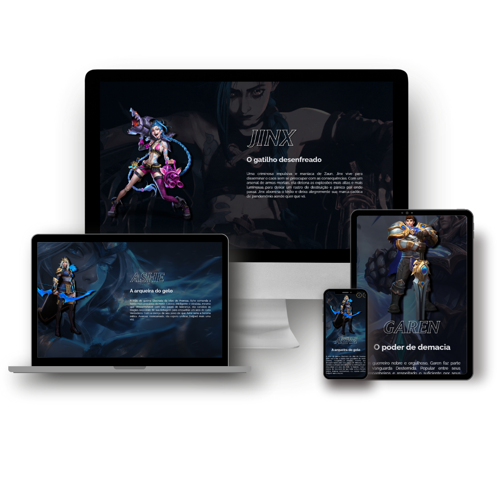

# lol-showcase

## 🎨 Imagem do Projeto

<p align="center"></p>

## 📄 Descrição

O projetolol-showcase é uma aplicação React que apresenta páginas personalizadas para alguns personagens do universo de League of Legends (LOL). Cada página de personagem exibe um efeito de entrada atraente, onde um background cobre a tela antes de revelar as informações do personagem. Esta aplicação é uma maneira divertida de explorar e aprender mais sobre a história de alguns campeões favoritos do League of Legends.

### Recursos:

- Páginas personalizadas para diversos campeões do universo League of Legends (LOL).
- Efeito de entrada com um overlay de background que desaparece após um período de tempo.
- Exibição das informações do campeão, incluindo nome, imagem e descrição.
- Navegação fácil entre as páginas de campeões.
- Design responsivo para uma experiência de usuário consistente em diferentes dispositivos.

<br>

[Link para o deploy](https://lol-champions-jade.vercel.app/)

<br>

## 🧑‍💻 Este projeto foi desenvolvido com

- <b>Node:</b> v18.14.2
- <b>React:</b> 18.2.0
- <b>styled-components:</b> para estilização.
- <b>react-router-dom</b>: para gerenciamento de rotas.
- <b>framer-motion:</b> para animações de entrada.
- <b>Assets:</b> para imagens e recursos do League of Legends (LOL).
  <br>

## 💻 Instalar e rodar o projeto

Rodar o lol-showcase em sua máquina local é uma tarefa extremamente simples.

### Dependências globais

É necessário ter a seguinte dependência instalada em sua máquina:

- Node.js LTS v16 (ou superior)

### Dependências locais

Para iniciar o projeto, clone este repositório:

```bash
https://github.com/thiago-weslley/lol-showcase.git
```

Em seguida, instale as dependências:

```bash
npm install
```

### Rodar o projeto:

Para rodar o projeto localmente, basta executar o comando abaixo:

```bash
npm run dev
```
